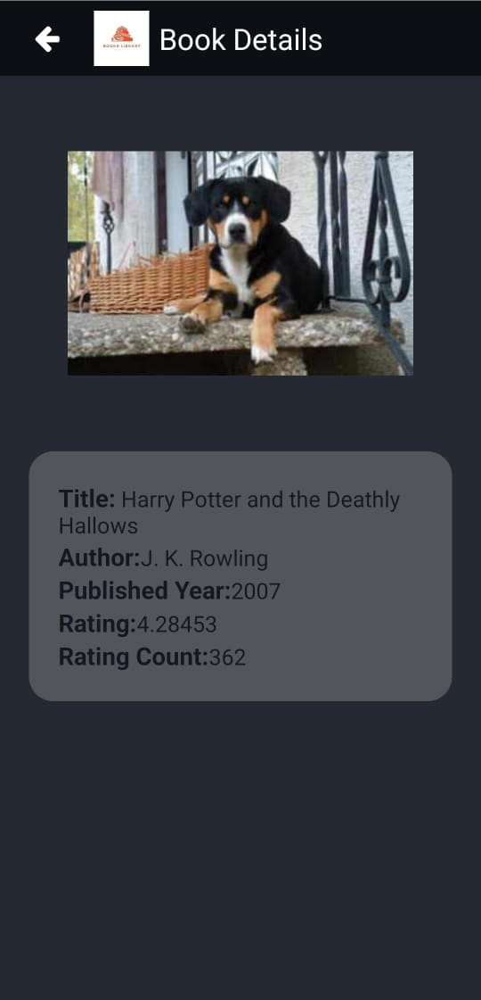

# Book Search App

This App helps users to Search Books and See Their Details.
Here for searching books data I used OpenLibrary API with end point [(https://openlibrary.org/dev/docs/api/search) ](https://openlibrary.org/dev/docs/api/search).

This App have few other features like Loading state indicator, Refresh control.

## Installation

After Cloning the repository. Open Terminal inside Root folder and Run the below command

```bash
npm install
```

## Usage

To Start the metro server run the below commands

```bash
npx react-native start
```

## App Preview

|  |  |  |  |
| :-----------------------------------------------------------------: | :----------------------------------------------------------------------: | :-----------------------------------------------------------------------------: | :------------------------------------------------------------------------: |
|                            _Home Screen_                            |                             _Detail Screen_                              |                            _Loading State Indicator_                            |                             _Refresh Control_                              |
